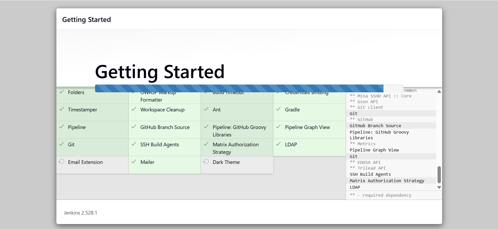
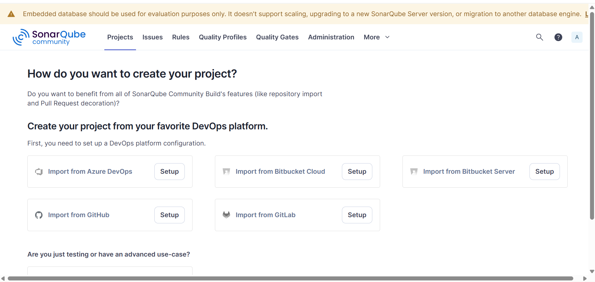
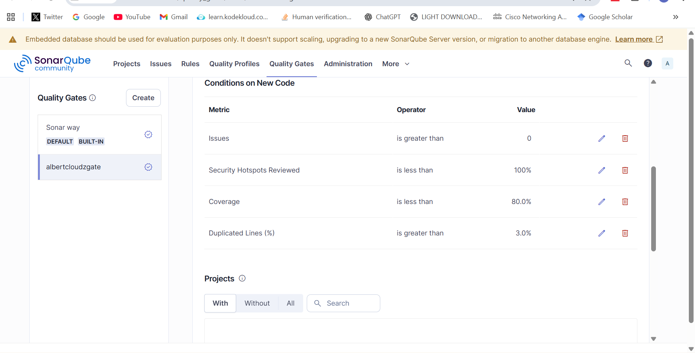

# 🧩 DevOps End-to-End CI/CD Pipeline Project

## Overview
This project demonstrates a complete DevOps CI/CD workflow using **Jenkins**, **SonarQube**, **Nexus**, and **Tomcat**, all deployed on **AWS EC2**. The goal is to automate the build, test, and deployment process for a Java web application.

## 🧠 Technologies Used
- Jenkins for CI/CD
- SonarQube for code quality analysis
- Nexus for artifact storage
- Tomcat for application deployment
- AWS EC2 (Ubuntu)
- Git & GitHub for version control

## ⚙️ Pipeline Workflow
1. Developer pushes code to GitHub
2. Jenkins triggers automatically
3. Jenkins performs build using Maven
4. SonarQube performs code quality analysis
5. Nexus stores the artifact (WAR file)
6. Jenkins deploys the artifact to Tomcat on EC2

## 🏗️ Architecture Diagram


## ⚙️ Setting Up Jenkins on AWS EC2 (t3.medium)

Jenkins was installed on an **AWS EC2 Ubuntu t3.medium instance**, which provides a balanced mix of CPU and memory suitable for running CI/CD workloads.  
The setup followed the step-by-step guide from the [Jenkins Setup Site](https://www.jenkins.io/doc/book/installing/), including the installation of required dependencies such as **Java**, **Git**, and the **Jenkins service** configuration.

After installation, Jenkins was accessed through the default port **8080**, where the **initial setup page** appeared, prompting for the administrator password and plugin configuration.

📸 **Screenshot:**

This server now serves as the **core automation engine** of the CI/CD pipeline, connecting seamlessly with **GitHub (via webhooks)**, **SonarQube**, **Nexus**, and **Tomcat** for continuous integration and deployment.

## 🧩 Setting Up SonarQube for Code Quality Analysis

SonarQube was installed on a dedicated **AWS EC2 Ubuntu instance (t3.medium)** and integrated with Jenkins to perform **automated code quality checks** after every build.  
The installation followed the guide in the [SonarQube Official Site for Setup](https://docs.sonarsource.com/sonarqube-server/server-installation/introduction), which includes steps for setting up **PostgreSQL**, configuring **SonarQube as a system service**, and opening the default **port 9000** for access.

Once the server was up and running, the **initial SonarQube dashboard** appeared, allowing configuration of projects, tokens, and **Quality Gates** to enforce clean code standards.

📸 **Screenshot:**  


A custom **Quality Gate** was defined to ensure that:
- Code coverage remains above a set threshold  
- No new critical issues or bugs are introduced  
- Maintainability, reliability, and security ratings remain within acceptable limits  

📸 **Screenshot:**  



### 🔐 Integrating SonarQube with Jenkins

To enable Jenkins to communicate securely with SonarQube, the **SonarQube Scanner** plugin was installed and configured in Jenkins.  
This setup allows Jenkins to trigger code analysis automatically during the pipeline execution.

Steps:
1. Navigate to **Manage Jenkins → System → SonarQube Servers**
2. Add a new server name (e.g., `sonarserver`)
3. Provide the **Server URL** (e.g., `http://<your-sonarqube-server>:9000`)
4. Add and select the **Authentication Token** generated from SonarQube under Jenkins credentials

📸 **Screenshot:**  


Once configured, the Jenkins pipeline can reference the server using:
```groovy
withSonarQubeEnv('sonarserver') {
    sh 'mvn sonar:sonar'
}
This setup ensures that Jenkins pipelines automatically trigger SonarQube analysis for every commit, providing developers with immediate feedback on code quality and technical debt.

